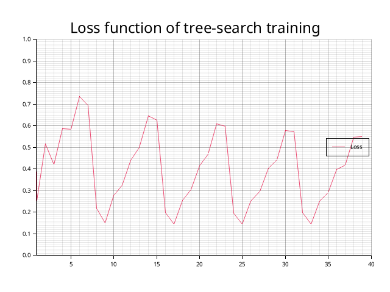
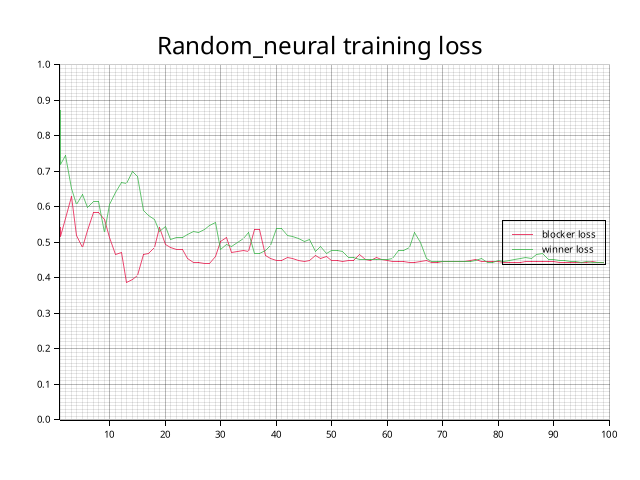
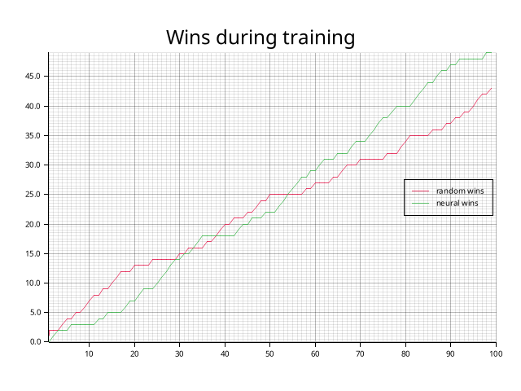

# A Tic-Tac-Toe game in Rust

My code project for the 2023 summer vacation was to convert a Swift tac-tac-toe game that I have previously written to the Rust language and learn some Rust doing it. 

It was a fun experience and I really enjoyed learning the basics of Rust.

In 2025 I have expanded it to support neural network play. Inspired by https://www.geeksforgeeks.org/numpy/implementation-of-neural-network-from-scratch-using-numpy/ I first wrote a python implementation of basic pattern recognition and then converted it into Rust. Then I expanded it to tic-tac-toe pattern training using basic tree search as training algorithm. 

## Training, first attempts 
Neural network setup: 9 input nodes, one hidden layer with 15 nodes, 9 output nodes
Input and output nodes represent tic-tac-toe board. The players are represented as -1 or 1. 0 means open square. Neural network always train and play being 1 to always train and use the weights the same way.

### Train with tree search 

Plays 5 rounds with tree-search vs tree-search. This means every move is always the best and boards will be played exactly the same way. Only train with when the move is done by the piece designated with value 1. 

This is done with the method train in the TicTacToeNeuralNet struct.
And tested with neural_struct_play() function in tests.rs. The assert is draw and this almost always succeeds. 

But in **_practical use this training fails_** since it is only applicable for the exact set of moves done by tree search. With any other moves, random or human, the neural network fails badly. 

The loss function each of the moves and varies greatly as the boards fills. Personally I think it would be better to have separate weights for each move, but this is not what gemini suggest. Gemini insists that one hidden layer for all moves should be able to cope with this setup. 

### Training with neural vs random play

Here the test random_struct_random_train test runs a training function
called train_random in the TicTacToeNeuralNet struct. train_random runs 100 rounds where random moves plays against the a neural network that are continously trained with the winner moves. 

The loss function is continously evaluated against using this board as input nodes. Output nodes are either winner move O or blocker move X at position 1(column),2(row):

      1 2 3
    1| | |X|
    2| |O|O|
    3| | |X|

The assert is to play draw against tree-search player, with neural net starting. And the result is that the test is almost never successful. It seems to be between 5 and 10% of training attempts that are able to play draw against tree-search. No clear pattern can be seen in loss function plots for the successful tests. 

For one of the few attempts that succeeded the assert the loss function was:

and the number of wins of random play and neural play as the training progressed was:

## Training, second attempt

One extra hidden layer. TODO.

## Features

* Play as X or O against the computer
* Random selection of who starts
* Most functions have unit tests
* computer vs computer is also a test. The output of the computer playing aginst itself can be viewed by selecting profile "Unit test with output" as "Run and Debug" profile in VS Code.
* computer tree seach vs neural net test where the assert is still a draw. This might not always happen if the initial matrix generation is unsuitable. 
  * The test can be run with a different number training rounds to see the impact of training. Tree search will almost always win without training. With 5 training rounds it will mostly be a draw.  

## Todo
* Extend number of hidden node layers to improve learning