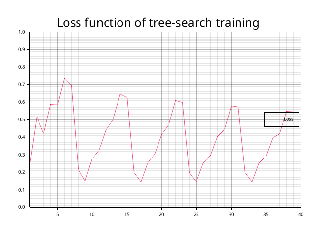
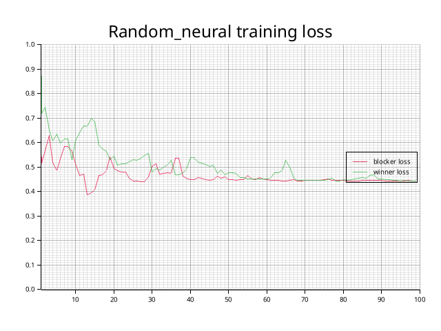
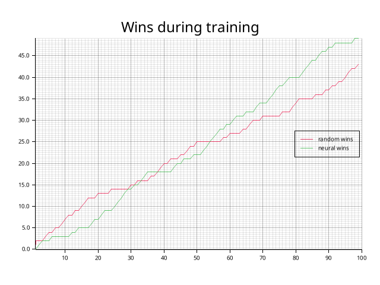
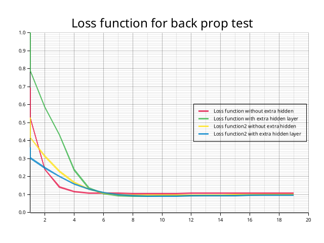
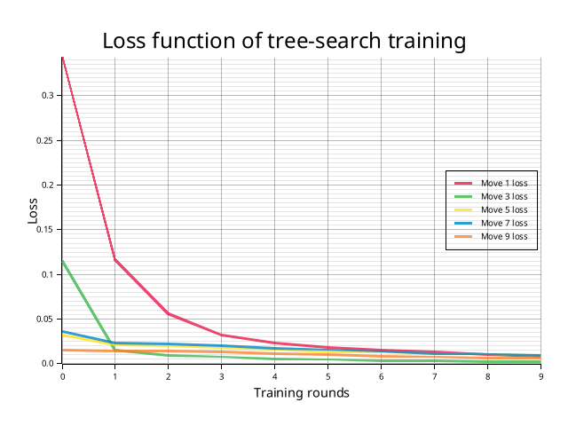
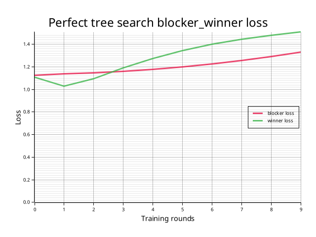
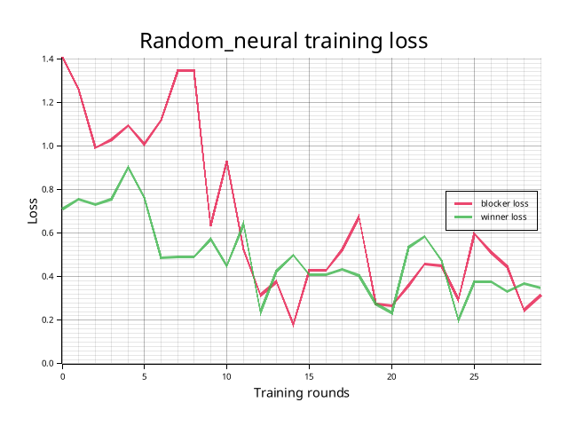
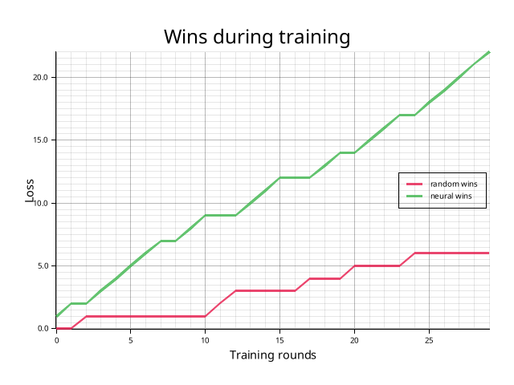

# A Tic-Tac-Toe game in Rust

My code project for the 2023 summer vacation was to convert a Swift tac-tac-toe game, that I have previously written, to the Rust language and learn some Rust doing it. 

It was a fun experience and I really enjoyed learning the basics of Rust.

In 2025 I have expanded it to support neural network play. Inspired by https://www.geeksforgeeks.org/numpy/implementation-of-neural-network-from-scratch-using-numpy/. I first wrote a python implementation of basic pattern recognition and then converted it into Rust. Then I expanded it to tic-tac-toe pattern training using basic tree search as training algorithm. 

## Training, first attempts 
Neural network setup: 9 input nodes, one hidden layer with 15 nodes, 9 output nodes
Input and output nodes represent tic-tac-toe board. The players are represented as -1 or 1. 0 means open square. Neural network always train and play being 1 to always train and use the weights the same way.

### Train with tree search 

Plays 5 rounds with tree-search vs tree-search. This means every move is always the best and boards will be played exactly the same way. Only train with when the move is done by the piece designated with value 1. 

This is done with the method train in the TicTacToeNeuralNet struct.
And tested with neural_struct_play() function in tests.rs. The assert is draw and this almost always succeeds. 

But in **_practical use this training fails_** since it is only applicable for the exact set of moves done by tree search. With any other moves, random or human, the neural network fails badly. 

The loss function each of the moves and varies greatly as the boards fills. Personally I think it would be better to have separate weights for each move, but this is not what gemini suggest. Gemini insists that one hidden layer for all moves should be able to cope with this setup. 

### Training with neural vs random play

Here the test random_struct_random_train test runs a training function
called train_random in the TicTacToeNeuralNet struct. train_random runs 100 rounds where random moves plays against the a neural network that are continously trained with the winner moves. 

The loss function is continously evaluated against using this board as input nodes. Output nodes are either X blocker move at position 1(column),2(row):

      1 2 3
    1| | |X|
    2| |O|O|
    3| | |X|

Or X winner move at same position:

      1 2 3
    1| | |O|
    2| |X|X|
    3| | |O|

The assert is to play draw against tree-search player, with neural net starting. And the result is that the test is almost **_never_** successful. It seems to be between 5 and 10% of training attempts that are able to play draw against tree-search. No clear pattern can be seen in loss function plots for the successful tests. 

For one of the few attempts that succeeded the assert the loss function was:

and the number of wins of random play and neural play as the training progressed was:

## Training, second attempt

### Testing the back prop function neural_struct.rs/back_prop

I wanted to add a second hidden layer. And in the process I wanted to make sure the back prop function was calculated correctly. First I did every step with fixed weight matrixses and asserted every step. Then I found out the obvious way to check the back prop, just train it with the same input and output vector and if it works properly the forward function should be able to guess the output vector pretty quickly after some training. What I discovered was that the network was unable to learn -1, it just became 0(zero). And thus an essential second player was not estimated by the network. The fix was to change the output activation function from a sigmoid to a bipolar tanh function which is able to estimate towards -1. 

I made a test function that changes one piece between input and output, which signifies the preferred piece during training and assert that this piece is selected by the forward process. This process is repeated 100 times. The last of the repeats are listed below. It seems there are a sweep spot between 15 and 20 training rounds before testing the network. With 20 training rounds the back prop test ran 10000 repeats of train and then estimate output without failing. 

Input and output 1 are:

    Input: [1, 0, -1, 0, 1, 0, 0, 0, -1]
    Output: [1, 0, -1, 0, 1, 1, 0, 0, -1]

Input and output 2 are:

    Input2: [0, 0, 0, 0, 0, 0, 0, 0, 0]
    Output2: [0, 0, 0, 0, 1, 0, 0, 0, 0]

Then I run twenty training runs with- and without an extra 15 node hidden network layer.

First input without extra hidden network estimates this output:

    [0.9648, -0.0032, -0.9769, -0.0019, 0.9542, 0.9822, -0.0019, -0.0009, -0.9673]

which clearly indicates that the new move should be where 0.9822 is. This is the red line in the the loss plot. 

With an extra hidden layer the output become 

    [0.9343, -0.0124, -0.9498, 0.0038, 0.9471, 0.9438, -0.0124, -0.0135, -0.9555]

which is also a good estimation. See how nicely the -1 locations are estimated. This is the green line in the plot.

Second input without hidden layer estimates this move:

    [0.0008, -0.0001, 0.0000, 0.0002, 0.9517, 0.0002, -0.0004, 0.0000, -0.0001]

which clearly indicates the middle piece with 0.9517. This is the yellow line. 

The second input with extra layer is estimated to:

    [-0.0026, 0.0045, -0.0031, -0.0017, 0.9390, -0.0033, -0.0035, -0.0020, -0.0051]

which gives 0.9390 in middle piece. This is the blue line in the plot. 
  

It should be noted that at first the networks with extra hidden layer were initialized with alpha = 0.05 which created and unstable network. They sometimes failed. In the extra hidden network alpha is divided by 2. This is to gradually increase the node values in the forward function. 

It should also be noted that the test uses a function to find the largest index; diff_vectors_and_ret_largest_index. This function uses the absolute value of the difference between the input and estimated output. This is because in real play the neural network might estimate that the highest score is given to -1 player for next move, and then the neural network which always plays as 1 should make that move as it could be a blocker for -1 win.   

### Train with tree search - second attempt

* Train neural network with perfect play tree search
* Train neural network based on who is starting, and for this test the neural network starts. This is done because I have found it difficult to train a network to play good when it is trained for both first and second move. 
* Plot loss function for each move as neural network
* Check one  up to ten training rounds with two iterations of each move

The results in the below table clearly shows that the network stabilizes after about 5 training rounds. It varies a bit, but it is around 4-6 rounds. If an extra hidden layer is introduced _**twice**_ as many training rounds are required, and it is a bit more unstable, sometimes showing some temporary backlashes around 14-15 training rounds. 

The loss function for each of the neural moves is shown below. In addition the loss function of the above described blocker and winner moves are also shown below. The blocker winner loss shows that the network has no ability to predict these moves, which a general tic-tac-toe network should have. 

| Training rounds | Tree search win | Neural win | Draw |
| --------------- | --------------- | ---------- | ---- |
| 1 | 4 | 0 | 1 |
| 2 | 3 | 0 | 2 |
| 3 | 2 | 0 | 3 |
| 4 | 1 | 0 | 4 |
| 5 | 0 | 0 | 5 |
| 6 | 0 | 0 | 5 |
| 7 | 0 | 0 | 5 |
| 8 | 0 | 0 | 5 |
| 9 | 0 | 0 | 5 |
| 10 | 0 | 0 | 5 |

Table: Table showing how many training rounds that is required for the neural network to always play draw against perfect play tree-search. 

#### NOTE: Usability of this neural network trained with perfect played tree-search
This neural network is not usable for any other oponent than perfect tree-search play which is clearly demonstrated by letting it play against a random player. And if I let the random player start it gets even worse. 

| Training rounds | Random win | Neural win | Draw |
| --------------- | ---------- | ---------- | ---- |
| 10 | 2 | 3 | 0 |
| 10 | 0 | 5 | 0 |
| 10 | 0 | 4 | 1 |
| 10 | 0 | 5 | 0 |
| 10 | 1 | 4 | 0 |

Table: Neural network trained with tree-search playing 5 games against a player that makes random moves. 

Figure: Loss function of neural network trained with perfect play tree-search. 

Figure: Loss function for the above described blocker and winner moves when neural network is trained with perfect play tree-search.  

### Training with random search - second attempt

The aim was to train the neural network doing random moves and use the winner moves to train the network, i.e. set winner piece to one and looser piece to -1. Then run the moves through the back prop function with alfa 0.1 and only one back prop iteration. As is clearly shown it is impossible to train the network to only play draw against tree search player. Adding another hidden layer just makes it more unstable and harder to train. Changing alfa value or making it gradually smaller does not help in any way,
Only using X moves to train, to get only the neural move order, does not help, it only makes it more likely to diverge in ability to block or win for the test blocker/winner tests.

The only conclusion is that is is possible to train it to win against a random opponent, but not consistenly play draw against a tree search player.  

| Training rounds | Tree search win | Neural win | Draw |
| --------------- | --------------- | ---------- | ---- |
| 1 | 5 | 0 | 0 |
| 2 | 5 | 0 | 0 |
| 3 | 3 | 0 | 2 |
| 4 | 5 | 0 | 0 |
| 5 | 4 | 0 | 1 |
| 6 | 5 | 0 | 0 |
| 7 | 5 | 0 | 0 |
| 8 | 3 | 0 | 2 |
| 9 | 5 | 0 | 0 |
| 10 | 4 | 0 | 1 |
| 11 | 5 | 0 | 0 |
| 12 | 4 | 0 | 1 |
| 13 | 4 | 0 | 1 |
| 14 | 4 | 0 | 1 |
| 15 | 4 | 0 | 1 |
| 16 | 5 | 0 | 0 |
| 17 | 5 | 0 | 0 |
| 18 | 4 | 0 | 1 |
| 19 | 5 | 0 | 0 |
| 20 | 5 | 0 | 0 |
| 21 | 5 | 0 | 0 |
| 22 | 5 | 0 | 0 |
| 23 | 4 | 0 | 1 |
| 24 | 4 | 0 | 1 |
| 25 | 4 | 0 | 1 |
| 26 | 5 | 0 | 0 |
| 27 | 5 | 0 | 0 |
| 28 | 5 | 0 | 0 |
| 29 | 5 | 0 | 0 |
| 30 | 5 | 0 | 0 |

Neural wins against tree search with max rounds of training: 0

| Training rounds | Random win | Neural win | Draw |
| --------------- | ---------- | ---------- | ---- |
| 10 | 0 | 4 | 1 |
| 10 | 2 | 2 | 1 |
| 10 | 0 | 3 | 2 |
| 10 | 0 | 5 | 0 |

Figure: Loss function of blocker and winner moves as described further up. Important note that if random wins, which has second move, is removed from the training the winner and blocker losses are more likely to diverge.   

and the number of wins of random play and neural play as the training progressed was:

Figure: Shows progress of neural vs random wins as training progresses during max training rounds. 

## Features

* Play as X or O against the computer
* Random selection of who starts
* Most functions have unit tests
* computer vs computer is also a test. The output of the computer playing aginst itself can be viewed by selecting profile "Unit test with output" as "Run and Debug" profile in VS Code.
* computer tree seach vs neural net test where the assert is still a draw. This might not always happen if the initial matrix generation is unsuitable. 
  * The test can be run with a different number training rounds to see the impact of training. Tree search will almost always win without training. With 5 training rounds it will mostly be a draw.  

## Todo
* Extend number of hidden node layers to improve learning